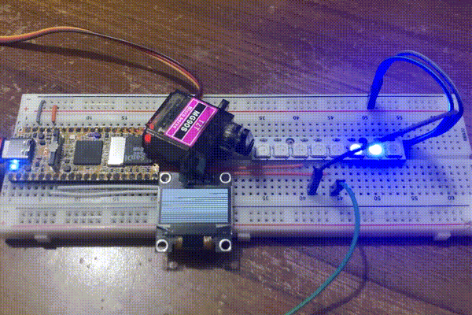

# mruby-milkv-duo

This mruby gem provides GPIO, ADC, PWM, I2C and SPI functionality for the [Milk-V Duo](https://milkv.io/duo) series of single board computers. It depends on the wiringX C library included in the Milk-V SDK, as well as some Linux `/dev` and `/sys` access.

The interface and feature set aim to match the [lgpio](https://github.com/denko-rb/lgpio) CRuby gem. This gem is primarily meant as a hardware abstraction layer for a future mruby port of [denko](https://github.com/denko-rb/denko).



## Features

### `Duo` Class Methods

- [x] GPIO Mode/Read/Write
- [x] GPIO Input Alerts
  - Alerts are generated by a separate thread, and can be read from a queue in mruby
  - **Does not** use interrupts. Polls pins every ~100 microseconds instead
- [x] Hardware PWM Output
- [x] Hardware I2C
- [x] Hardware SPI
  - Only default SPI mode for now (should be SPI mode 0)
- [x] Ultrasonic Read (HC-SR04)
- [x] Pulse Sequence Read (DHT enviro sensors)
- [x] Bit Bang I2C
- [x] Bit Bang SPI
  - SPI modes 0 through 3 supported
  - Optional LSBFIRST or MSBFIRST transfers
- [x] Bit Bang 1-Wire
- [x] WS2812 addressable LEDs over Hardware SPI
  - Only outputs on SPI2 MOSI pin
  - SPI clock must be set to 2.4 MHz
- [x] On-off Keying (OOK) Modulated Waves (based on Hardware PWM)
  - Carrier generated by hardware PWM. Software modulated with monotonic clock timing.

### Classes

- [x] `Duo::HardwarePWM` (convenience wrapper for PWM methods)
- [x] `Duo::PositionalServo` (based on Hardware PWM)
- [x] `Duo::Infrared` (based on OOK waves)
  - Default frequency: 38 kHz. Default duty cycle: 33.33%
- [X] `Duo::AnalogInput` (based on sysfs SARADC interface)
  - On GPIO 26 and 27 only
  - Always 12-bit resolution (0-4095 range)
  - Full scale voltage is only 1.8V, **not** 3.3V.

### Pinmux

- Some features of the Duo are mulltiplexed onto the same pins
- Use `duo-pinmux` to set them up BEFORE using them. See [official docs](https://milkv.io/docs/duo/application-development/pinmux) for more info.
- Run `mruby pinmux_custom.rb` from the examples folder, to get the pinmux layout used in all examples

## Install Instructions

- Download the Linux image for your board, from the [official repo](https://github.com/milkv-duo/duo-buildroot-sdk/releases).
- Using [balenaEtcher](https://www.balena.io/etcher) or similar, flash the image to a micro SD card.
- Insert the SD card into your Duo and connect it to your computer.
- Download and unzip the mruby binaries for your board, from the [releases section](releases) of this repo.
- The Milk-V Duo should have set up a new network interface on your computer so you can SSH/SCP into it. The default username is `root` and password is `milkv`.
- Copy the binaries onto the board:
  - Linux:
  ```console
  scp -O UNZIPPED_BINARY_FOLDER/* root@192.168.42.1:/usr/local/bin
  ```
  - Mac:
  ```console
  scp UNZIPPED_BINARY_FOLDER/* root@192.168.42.1:/usr/local/bin
  ```
- SSH into the board: `ssh root@192.168.42.1`.
- Try the `mirb` shell, or copy over examples from [this](examples) folder, and try them with `mruby filename.rb`.

## Build Instructions
- Unless running Ubuntu, set up a virtual machine with Ubuntu 24.04, then install:

```console
sudo apt install wget git make gcc
```

- Clone mruby and duo-sdk, then enter the mruby directory:

```console
git clone https://github.com/mruby/mruby
git clone https://github.com/milkv-duo/duo-sdk
cd mruby
```

- In `mruby/build_config/milkv_duo.rb`:
  - Set `MILKV_DUO_VARIANT` to the string that matches your board
  - Uncomment `conf.gem :github => 'denko-rb/mruby-milkv-duo'` (last line), to enable this gem

- Cross-compile mruby with: `rake MRUBY_CONFIG=build_config/milkv_duo.rb`.
- The binaries will be in `build/milv_duo/bin/`, relative to the `mruby` top-level directory.
- Follow the install instructions above to copy them to the board.
